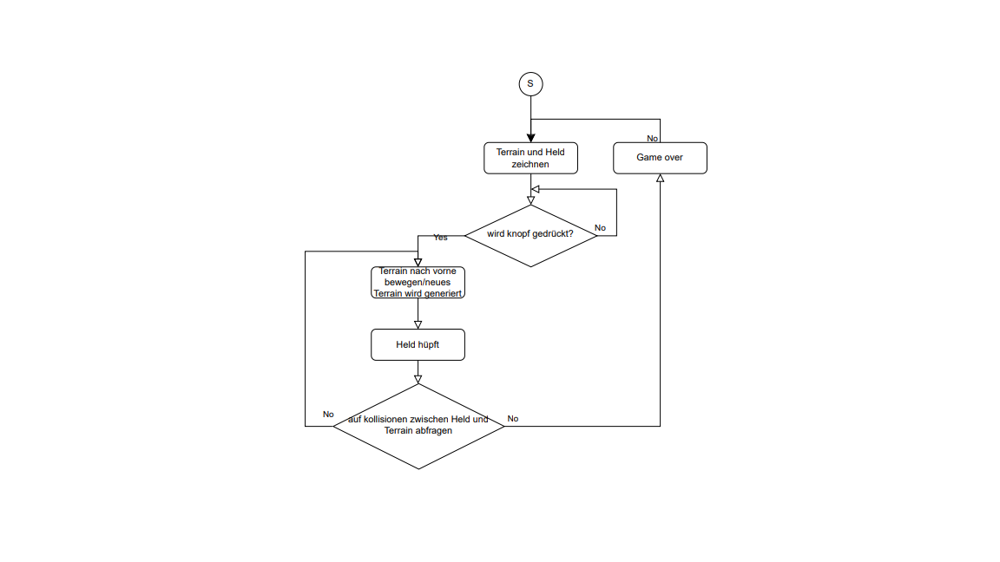
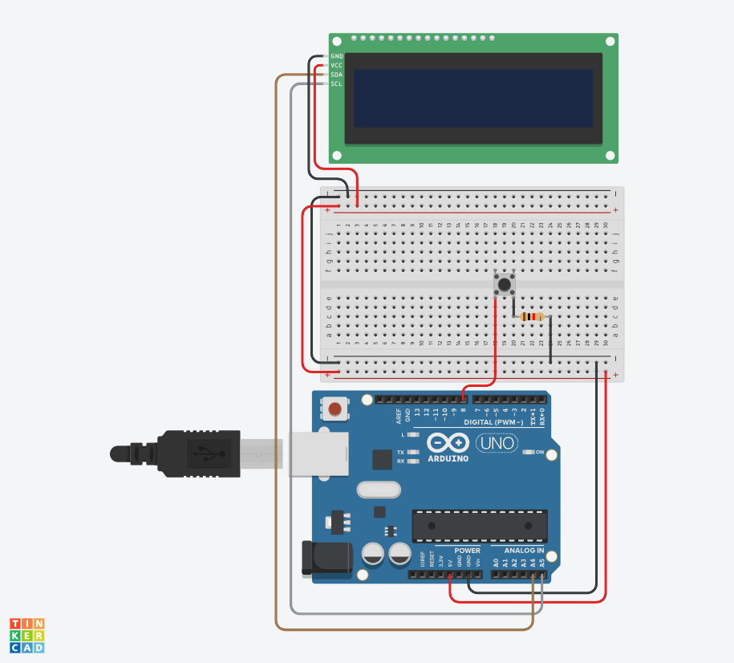
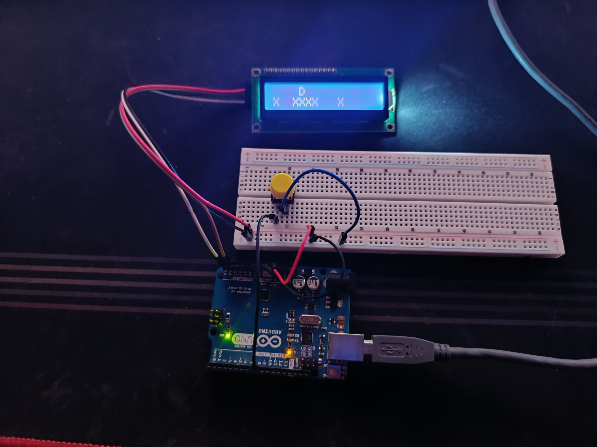

# Dino Game auf LCD-Display

## Beschreibung
Dieses Projekt ist eine Umsetzung des klassischen Dino-Games, das auf einem LCD-Display läuft. Der Spieler steuert einen Dino, der über Hindernisse springen muss. Ziel ist es, eine unterhaltsame und portable Version des Spiels zu erstellen, die auf Mikrocontrollern läuft.

## Flussdiagramm

## Schaltplan

## Foto des finalen Aufbaus

## Bauteilliste / Stückliste
| Bauteil           | Anzahl | Beschreibung                |
|-------------------|--------|-----------------------------|
| Arduino Uno       | 1      | Steuerung des Spiels        |
| LCD-Display       | 1      | Anzeige des Spiels          |
| Taster            | 1      | Steuerung des Dinos         |

## Learnings
- **Herausforderungen:**
  - Darstellung und Aktualisierung der Spielfiguren und Teritoriums auf dem LCD
  - Reaktionszeit für das Springen und die Landung optimieren

- **Was wir gelernt haben:**
  - Programmierung von Animationen auf einem LCD
  - Nutzung von Interrupts für die Steuerung
  - Arbeiten mit Mikrocontrollern und deren Peripherie
  - Umsetzung eines einfachen Spiels mit begrenzten Ressourcen
